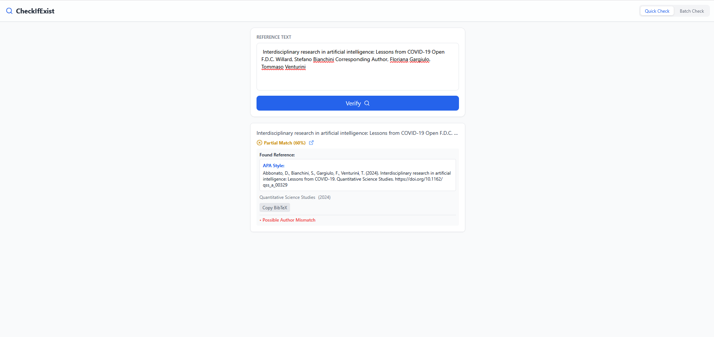
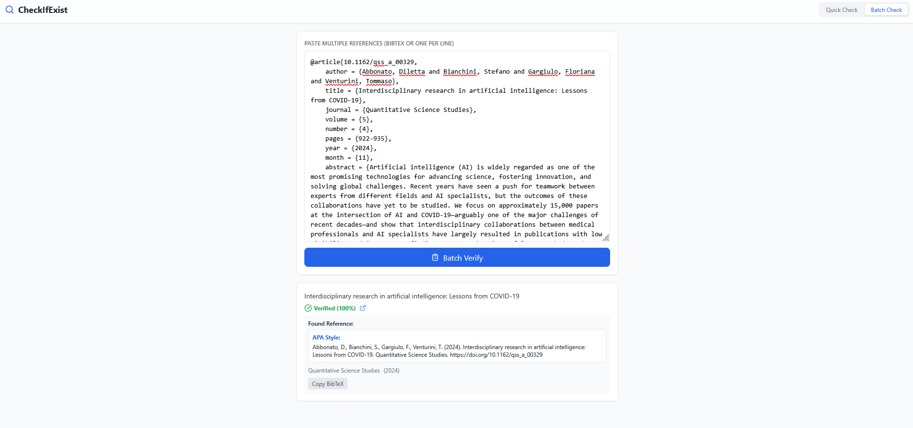
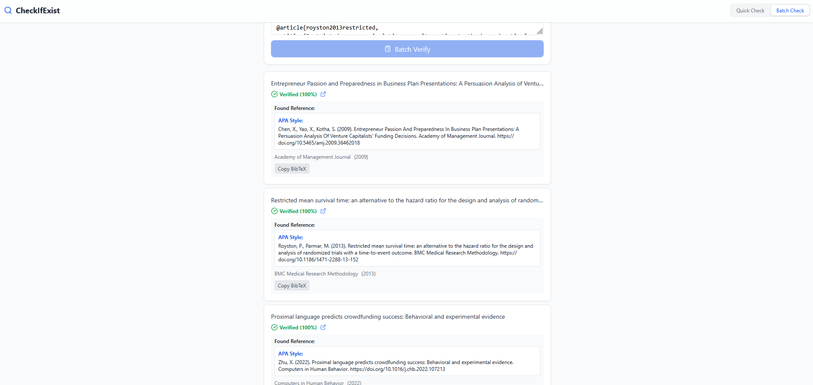

# CheckIfExists - Reference Verification Tool 🔍

**CheckIfExist** is a tool for researchers and academics to verify the authenticity of references. It cross-checks citations against the CrossRef database to detect hallucinations, verify metadata, and ensure accuracy in your bibliography.

## 📸 Screenshots

<p align="center">
  
  
  
</p>

## 🚀 Features
- **Quick Verification**: Verification of single references via text selection or clipboard.
- **Batch Mode**: Paste a list of BibTeX entries to verify them all at once.
- **Advanced Logic**:
  - Detects partial matches (e.g., correct title but wrong author).
  - Handles "First Name Last Name" vs "Last Name First Name" variations.
  - Penalizes scores for missing authors in the query.
- **Output Formats**:
  - **APA Style**: Get the correct APA citation instantly.
  - **BibTeX**: Generates a valid BibTeX entry for the *found* paper.

## 🛠 **Run Locally**

If you want to run the code yourself:

1.  **Clone the repo**
    ```bash
    git clone https://github.com/zabbonat/References-Validation.git
    cd References-Validation
    ```

2.  **Install dependencies**
    ```bash
    npm install
    ```

3.  **Run the web app**
    ```bash
    npm run dev
    ```

## 📄 License
MIT
